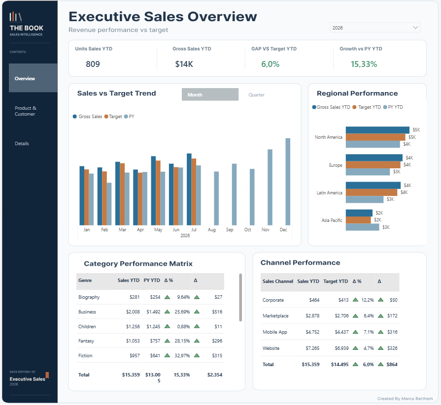
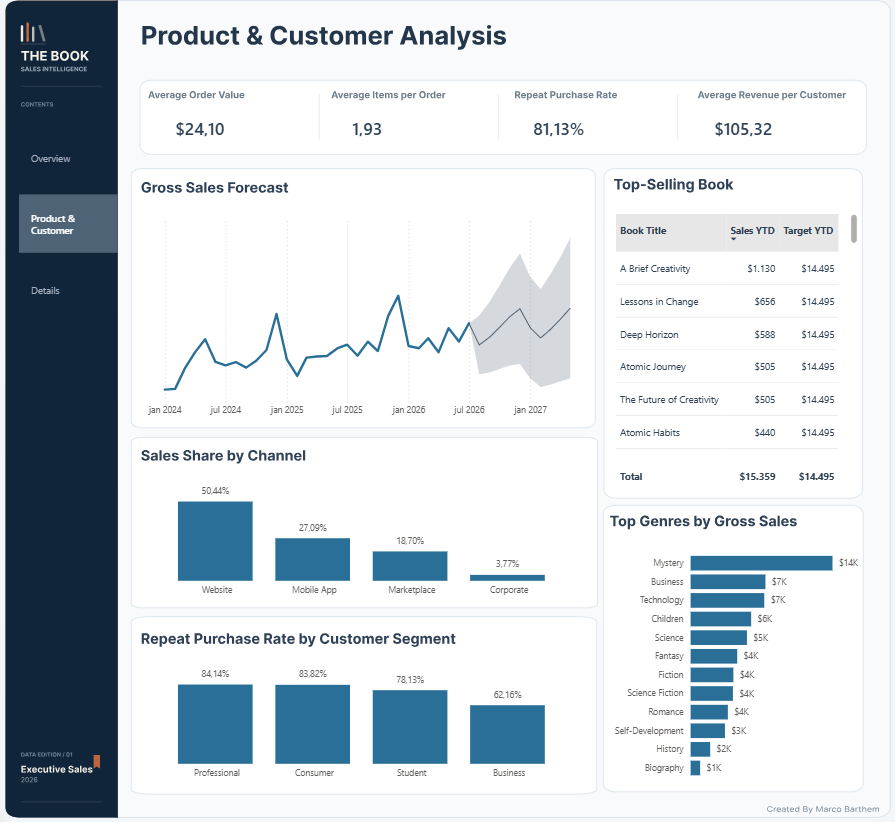
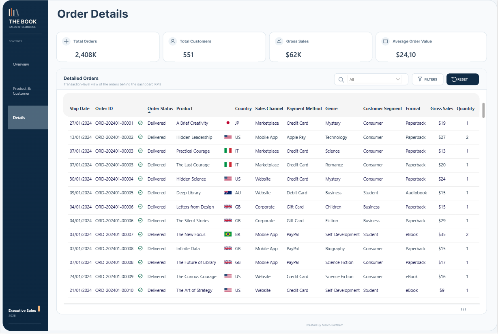

# 📚 The Book — Sales Analytics Dashboard

A Power BI sales analytics project built around a fictional bookstore dataset.

The project combines **business analysis, dashboard design, data modeling, DAX, and Power Query**, while also providing reusable components that can be adapted to other Power BI projects.

This repository can be used both as a **portfolio project** and as a reference for Power BI layouts, measures, Power Query scripts, and report structure.

---

## 📊 Dashboard Preview

### Executive Sales Overview

<p align="center">
  
</p>

The executive page provides a high-level view of business performance, including sales evolution, targets, regional performance, and sales channels.

---

### Product & Customer Analysis

<p align="center">
  
</p>

This page focuses on product and customer behavior, including:

* Average Order Value
* Average Items per Order
* Repeat Purchase Rate
* Average Revenue per Customer
* Top-Selling Books
* Top Genres by Gross Sales
* Customer Segments
* Sales Share by Channel

---

### Order Details

<p align="center">
  
</p>

A detailed transactional view that allows users to explore the individual orders behind the dashboard KPIs.

It includes information such as customer, product, country, sales channel, quantity, revenue, profit, and order status.

---

## 🎯 Project Purpose

This repository was created not only to demonstrate a sales analysis, but also to provide examples of **reusable Power BI components**.

Some elements of the project can be adapted to other dashboards, including:

* Dashboard page layouts
* KPI card structures
* Table and matrix designs
* Customer behavior metrics
* Power Query calendar table
* DAX measures
* Navigation and report structure
* Power BI visual design patterns

---

## 🧩 Reusable Components

### Power BI Template

The `.pbit` file can be downloaded and used as a starting point for other Power BI projects.

It contains the report structure, visuals, pages, measures, and design configuration without requiring the original PBIX file.

**File:** `Book Store Dashboard.pbit`

---

### Calendar Table

The project includes a reusable Power Query calendar table with attributes commonly used in Power BI models.

Examples include:

* Date
* Year
* Quarter
* Month
* Month Number
* Short Month
* Month-Year
* Week
* Day
* Current Month indicators

The script can be adapted to different date ranges and reused in other Power BI projects.

---

## 🛠️ Tools & Technologies

* **Power BI**
* **DAX**
* **Power Query**
* **Data Modeling**
* **Data Visualization**
* **Figma** — dashboard layout and UI design

---

## 📁 Repository Structure

```text
The-Book-Sales-Analytics-Dashboard/
│
├── README.md
├── Book Store Dashboard.pbix
├── Book Store Dashboard.pbit
│
├── images/
│   ├── executive-sales-overview.png
│   ├── product-customer-analysis.png
│   └── order-details.png
│
├── power-query/
│   └── Calendar_Table.m
│
└── docs/
    └── DAX Measures.md
```

---

## 💡 Business Questions

The dashboard was designed to answer questions such as:

* Are sales growing over time?
* Are actual sales aligned with targets?
* Which regions and channels generate the most revenue?
* Which books and genres drive sales?
* What is the average customer order value?
* How many items are purchased per order?
* How frequently do customers return?
* Which customer segments generate the most revenue?
* Which individual orders are behind the aggregated KPIs?

---

## 📐 Design Approach

The dashboard follows a clean and minimal visual structure focused on:

* Clear information hierarchy
* Low visual clutter
* Consistent spacing
* Limited color usage
* Executive-level KPIs
* Easy navigation between overview and detailed analysis
* Fast identification of relevant patterns

The goal is to make the dashboard useful not only for reporting data, but also for supporting business decisions.

---

## 🚀 How to Use

You can:

1. Download the `.pbix` file to explore the complete project.
2. Download the `.pbit` file to reuse the dashboard structure.
3. Copy the Power Query calendar script into another Power BI project.
4. Use the dashboard layouts as references for future Power BI projects.
5. Adapt the DAX measures and visual structures to your own datasets.

---

## 👤 Author

**Marco Barthem**

Production Engineer focused on **Data Analytics, Business Intelligence, Power BI, and data-driven decision making**.
